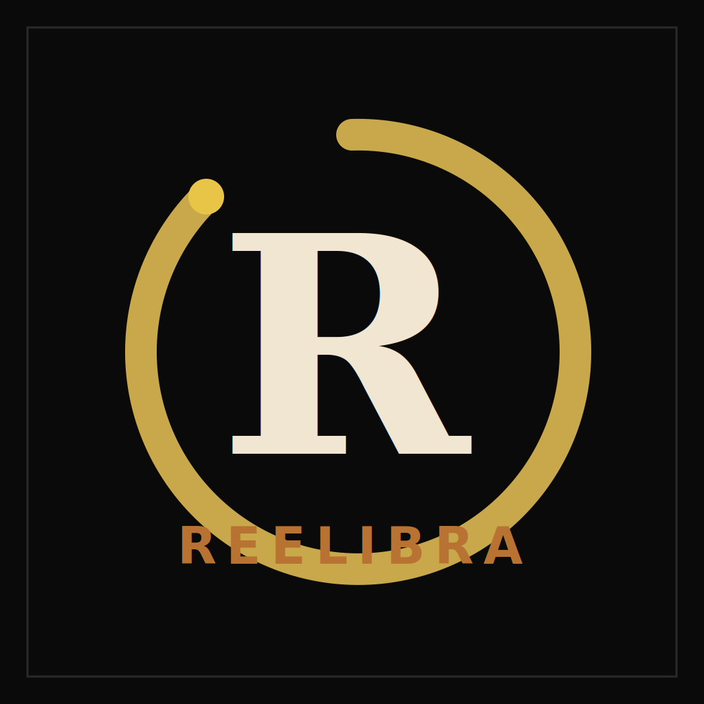

  

  # Reelibra

  **Локальная нарезка длинных видео на вертикальные рилсы (9:16) через ИИ.**
  **Local AI editor that turns long videos into vertical reels (9:16).**

  [Русский](#-русский) · [English](#-english)

---

## 🇷🇺 Русский

Reelibra берёт длинное видео (интервью, подкаст, выступление, скринкаст) и собирает из него короткие вертикальные рилсы. Не режет подряд, а **виртуально монтирует** — LLM анализирует транскрипт по драматургии и собирает рилсы из разных частей исходника.

Работает **локально на вашем компьютере**. Облако используется только для LLM-анализа (Google Gemini) и, на Windows/Linux, для распознавания речи (Deepgram).

### Что умеет
- Загрузка длинного видео → автоматическая нарезка на набор рилсов.
- **Два режима интерфейса:**
  - **Пошаговый** — мастер от «Создай проект» до готовых рилсов: ведёт за руку, разумные настройки по умолчанию. Для новичков.
  - **Эксперт-студия** — все настройки сразу + подсказка напротив каждого контрола. Для тех, кто хочет контроль.
- Транскрипция речи (локально на Mac / через Deepgram на Windows/Linux), субтитры с настраиваемым стилем, выравнивание громкости.
- Просмотр и отбор рилсов (в т.ч. свайп-режим), правка субтитров, экспорт под платформы.
- Опционально: публикация в Instagram Reels / YouTube Shorts через Publer; проекты-папки; локальный анализ кадра (Vision, по умолчанию выключен).

### Поддерживаемые системы
| Система | Поддержка | Распознавание речи |
|---------|-----------|--------------------|
| **macOS (Apple Silicon, M1+)** | ✅ Полная | Локально (без облака и без ключа) |
| **macOS (Intel)** | ⚠️ Частично | Только Deepgram (облако, нужен ключ) |
| **Windows 10/11 (64-бит)** | ✅ Да | Только Deepgram (облако, нужен ключ) |
| **Linux (x86_64, glibc ≥ 2.35)** | ✅ Да | Только Deepgram (облако, нужен ключ) |

**Windows 7 и 8 не поддерживаются** — современные компоненты (Python 3.12+, ML-библиотеки) на них физически не работают. Минимум — Windows 10 64-бит (сборка 1809+).

### Запуск в два клика
1. Скачайте репозиторий (кнопка **Code → Download ZIP** на GitHub) и распакуйте. Или `git clone`.
2. Запустите файл для вашей системы:
   - **Windows:** двойной клик по **`reelibraWIN.cmd`**
   - **macOS:** двойной клик по **`reelibraMAC.command`** (первый раз: правый клик → «Открыть», т.к. приложение не подписано)
   - **Linux:** запустите `./reelibraLINUX.sh` в терминале, либо один раз `bash launchers/linux/install.sh` — появится ярлык в меню приложений.
3. **Больше ничего ставить не нужно.** При первом запуске Reelibra сам скачает и настроит всё необходимое (Python, Node.js, ffmpeg) в свою локальную папку — с показом прогресса. Ничего в систему не устанавливается, прав администратора не требуется.
4. Когда всё готово — откроется браузер на `http://localhost:3000`.

> Первый запуск дольше: идёт загрузка компонентов (нужен интернет, несколько минут в зависимости от скорости сети). Последующие запуски — быстрые. Каждый запуск Reelibra проверяет окружение и подчищает зависшие процессы от прошлого раза.

### Ключи API (что нужно положить в `.env`)
При первом запуске создаётся файл `.env` из шаблона `.env.example`. Откройте его и впишите ключи:

| Ключ | Обязателен | Зачем |
|------|-----------|-------|
| `GEMINI_API_KEY` | **Да, всегда** | LLM-анализ (ядро нарезки). Бесплатный ключ — [Google AI Studio](https://aistudio.google.com/apikey). |
| `DEEPGRAM_API_KEY` | **Да на Windows/Linux** (и на Intel-Mac) | Распознавание речи в облаке. На Apple Silicon не нужен (работает локально). [deepgram.com](https://deepgram.com). |
| `PUBLER_API_KEY` + `PUBLER_WORKSPACE_ID` | Нет (опционально) | Публикация рилсов в соцсети через Publer. |
| `ZHIPU_API_KEY` | Нет (опционально) | Альтернативный LLM-провайдер (GLM). |

### Требования к железу (честно)
**Дискретная видеокарта не обязательна.** LLM-анализ идёт в облаке, а кодирование видео — на процессоре (CPU).

Но **программа ресурсоёмкая, и скорость работы напрямую зависит от железа.** На слабом процессоре нарезка и кодирование будут сильно нагружать компьютер и идти медленно.

| | Минимум | Комфортно |
|---|---------|-----------|
| CPU | 4 ядра | 8+ ядер |
| RAM | 8 ГБ | 16 ГБ |
| Диск | ~10 ГБ под программу + до 30 ГБ под загружаемые видео | SSD |
| Сеть | Обязательна (облачный LLM + первая загрузка) | |
| macOS | Apple Silicon M1, 16 ГБ | M2/M3+, 24 ГБ |

**GPU (опционально):** нужна только если включить локальный слой анализа кадра (Vision, по умолчанию выключен). Тогда — Nvidia от RTX 3060 12 ГБ + ручная пересборка. Для базовой нарезки GPU не нужен.

### Что под капотом (тех. часть)
- **Монорепо:** backend на Python (FastAPI, порт 8000) + frontend на React 19 + Vite (порт 3000). Данные — SQLite.
- **Запуск вручную (для разработки):** `./run.sh` (нужны установленные `uv`, `node`, `ffmpeg`).
- **LLM-стек:** Google Gemini (по умолчанию), опционально Zhipu GLM.
- **Распознавание речи:** на Apple Silicon — локальный MLX (`stable_ts_mlx`); на Windows/Linux/Intel — Deepgram (облако).
- **Видео:** ffmpeg, кодирование HEVC/H.264 (на Mac — VideoToolbox, иначе libx264/libx265 — на CPU).
- **Локальные данные** (`data/`, база, загруженные видео, готовые рилсы) хранятся только у вас и не покидают компьютер.

### Честные ограничения
- На Windows/Linux без ключа Deepgram распознавание речи работать не будет (на Apple Silicon — будет локально).
- Кодирование на CPU: на слабых машинах медленно.
- Слой анализа кадра (Vision) и трекинг лица по умолчанию выключены (экспериментальные, требуют ресурсов).

---

## 🇬🇧 English

Reelibra takes a long video (interview, podcast, talk, screencast) and assembles short vertical reels from it. It doesn't cut sequentially — it **virtually edits**: an LLM analyzes the transcript by dramaturgy and assembles reels from different parts of the source.

It runs **locally on your machine**. The cloud is used only for LLM analysis (Google Gemini) and, on Windows/Linux, for speech recognition (Deepgram).

### Features
- Upload a long video → automatic cut into a set of reels.
- **Two interface modes:**
  - **Step-by-step** — a wizard from "Create project" to finished reels: guides you, sensible defaults. For newcomers.
  - **Expert studio** — all settings at once + a tooltip next to every control. For full control.
- Speech transcription (locally on Mac / via Deepgram on Windows/Linux), styled subtitles, loudness normalization.
- Review and pick reels (incl. swipe mode), edit subtitles, export per platform.
- Optional: publish to Instagram Reels / YouTube Shorts via Publer; project folders; local frame analysis (Vision, off by default).

### Supported systems
| System | Support | Speech recognition |
|--------|---------|--------------------|
| **macOS (Apple Silicon, M1+)** | ✅ Full | Local (no cloud, no key) |
| **macOS (Intel)** | ⚠️ Partial | Deepgram only (cloud, key required) |
| **Windows 10/11 (64-bit)** | ✅ Yes | Deepgram only (cloud, key required) |
| **Linux (x86_64, glibc ≥ 2.35)** | ✅ Yes | Deepgram only (cloud, key required) |

**Windows 7 and 8 are not supported** — modern components (Python 3.12+, ML libraries) physically don't run on them. Minimum is Windows 10 64-bit (build 1809+).

### Two-click launch
1. Download the repo (**Code → Download ZIP** on GitHub) and unzip. Or `git clone`.
2. Run the file for your system:
   - **Windows:** double-click **`reelibraWIN.cmd`**
   - **macOS:** double-click **`reelibraMAC.command`** (first time: right-click → "Open", since the app is unsigned)
   - **Linux:** run `./reelibraLINUX.sh` in a terminal, or once `bash launchers/linux/install.sh` to get an app-menu shortcut.
3. **Nothing else to install.** On first run Reelibra downloads and sets up everything it needs (Python, Node.js, ffmpeg) into its own local folder — with a progress display. Nothing is installed system-wide, no admin rights required.
4. When ready, your browser opens at `http://localhost:3000`.

> The first run takes longer: it downloads components (internet required, a few minutes depending on your connection). Later runs are fast. Every launch Reelibra checks the environment and cleans up stale processes from last time.

### API keys (put them in `.env`)
On first run a `.env` file is created from `.env.example`. Open it and fill in the keys:

| Key | Required | Why |
|-----|----------|-----|
| `GEMINI_API_KEY` | **Yes, always** | LLM analysis (core of the editing). Free key — [Google AI Studio](https://aistudio.google.com/apikey). |
| `DEEPGRAM_API_KEY` | **Yes on Windows/Linux** (and Intel Mac) | Cloud speech recognition. Not needed on Apple Silicon (works locally). [deepgram.com](https://deepgram.com). |
| `PUBLER_API_KEY` + `PUBLER_WORKSPACE_ID` | No (optional) | Publishing reels to social media via Publer. |
| `ZHIPU_API_KEY` | No (optional) | Alternative LLM provider (GLM). |

### Hardware requirements (honest)
**A discrete GPU is not required.** LLM analysis runs in the cloud, and video encoding runs on the CPU.

But **the program is resource-intensive, and its speed depends directly on your hardware.** On a weak CPU, cutting and encoding will heavily load the machine and run slowly.

| | Minimum | Comfortable |
|---|---------|-------------|
| CPU | 4 cores | 8+ cores |
| RAM | 8 GB | 16 GB |
| Disk | ~10 GB for the app + up to 30 GB for uploaded videos | SSD |
| Network | Required (cloud LLM + first download) | |
| macOS | Apple Silicon M1, 16 GB | M2/M3+, 24 GB |

**GPU (optional):** only needed if you enable the local frame-analysis layer (Vision, off by default). Then — Nvidia from RTX 3060 12 GB + manual rebuild. For basic editing, no GPU is needed.

### Under the hood (technical)
- **Monorepo:** Python backend (FastAPI, port 8000) + React 19 + Vite frontend (port 3000). Data in SQLite.
- **Manual run (for development):** `./run.sh` (requires `uv`, `node`, `ffmpeg` installed).
- **LLM stack:** Google Gemini (default), optionally Zhipu GLM.
- **Speech recognition:** Apple Silicon — local MLX (`stable_ts_mlx`); Windows/Linux/Intel — Deepgram (cloud).
- **Video:** ffmpeg, HEVC/H.264 encoding (VideoToolbox on Mac, otherwise libx264/libx265 — on CPU).
- **Local data** (`data/`, database, uploaded videos, finished reels) stays only on your machine and never leaves it.

### Honest limitations
- On Windows/Linux without a Deepgram key, speech recognition won't work (on Apple Silicon it works locally).
- CPU encoding: slow on weak machines.
- The frame-analysis layer (Vision) and face tracking are off by default (experimental, resource-heavy).

---

  Reelibra · самурайская латунь на чёрном лаке / brass on black lacquer

