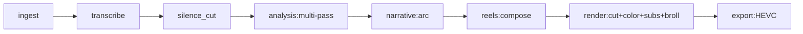

# REFACTR-05 — Pipeline stages и зависимости

> **Этап:** 00 — Исследование и аудит
> **Шаг:** 6 из 67
> **Зависимости:** REFACTR-00 (карта backend).
> **Следующий шаг:** REFACTR-06 (UX-боли)

---

## Роли

### R-AUDITOR — Аудитор
**Профессия:** Картограф pipeline.
**Soul:** Pipeline — нервная система. Знать каждый синапс = знать, где применить обезболивание, когда начнётся операция.

### R-PIPELINE-ENG (консультативно)
**Профессия:** Инженер data-pipeline.
**Soul:** Pipeline должен быть возобновляемым на любом шаге. Если нет — это bug, не feature.

---

## ТРИЗ-принцип

*Принцип матрёшки.* Pipeline = стадии (3 верхних: ingest, analysis, render) → под-стадии (transcribe, silence, LLM-multi-pass, cut, color, subtitles, broll, overlay, export) → функции. Аудит раскапывает всю матрёшку.

---

## Оркестрация

**Режим:** Sequential.

---

## Микрозадачи

### 05.1 Прочитать pipeline.py и pipeline_stages/

- [x] `services/pipeline.py` — главный оркестратор.
- [x] `services/pipeline_stages/{ingest,analysis,render}.py`.
- [x] `services/pipeline_context.py` и `pipeline_mode.py`.
- [x] `services/agents/{base,orchestrator}.py`.

### 05.2 Построить граф стадий

Формат Mermaid:

Реальный граф может быть более разветвлённым. Записать какой есть на самом деле.

### 05.3 Каждая стадия: вход/выход/побочные эффекты

| Стадия | Вход | Выход | Побочные эффекты (файлы, БД) |
|--------|------|-------|------------------------------|
| ingest | video path | Job record | data/uploads/, БД |
| transcribe | audio | transcript.json | data/artifacts/{job}/transcript.json |
| silence_cut | transcript + audio | cleaned_segments | data/artifacts/{job}/segments.json |
| ... | | | |

### 05.4 Точки возобновления

Владелец хочет «перезапустить с шага X». Для этого:
- [x] Отметить в каждой стадии: есть ли чекпоинт-файл на диске (можно ли продолжить отсюда без повторения предыдущей).
- [x] Отметить стадии, где чекпоинта нет — это будущая работа для Этапа 02 (REFACTR-16).

### 05.5 SSE progress events

- [x] `services/job_event_bus.py` — как работает.
- [x] Какие события шлются на фронт.
- [x] Формат events (типы, payload).

### 05.6 Артефакт

`docs/audit/05-pipeline-stages.md`:
- Граф стадий (Mermaid).
- Таблица вход/выход/артефакты.
- Таблица точек возобновления.
- SSE события.

### 05.7 Serena memory

- [x] `write_memory(name="refactr-05-pipeline-stages", content="...")`.

---

## GATE-чекпоинт

- [x] Полный граф стадий построен.
- [x] Все стадии инвентаризированы (вход, выход, артефакт).
- [x] Точки возобновления классифицированы (есть чекпоинт / нет чекпоинта).
- [x] SSE-события перечислены.

---

## Артефакт на выходе

`docs/audit/05-pipeline-stages.md` — полная карта pipeline.
