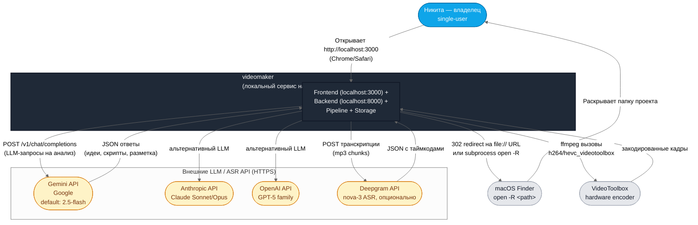
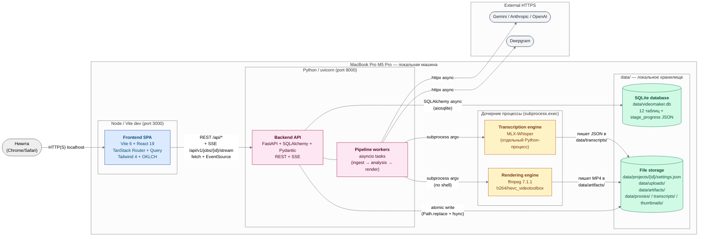
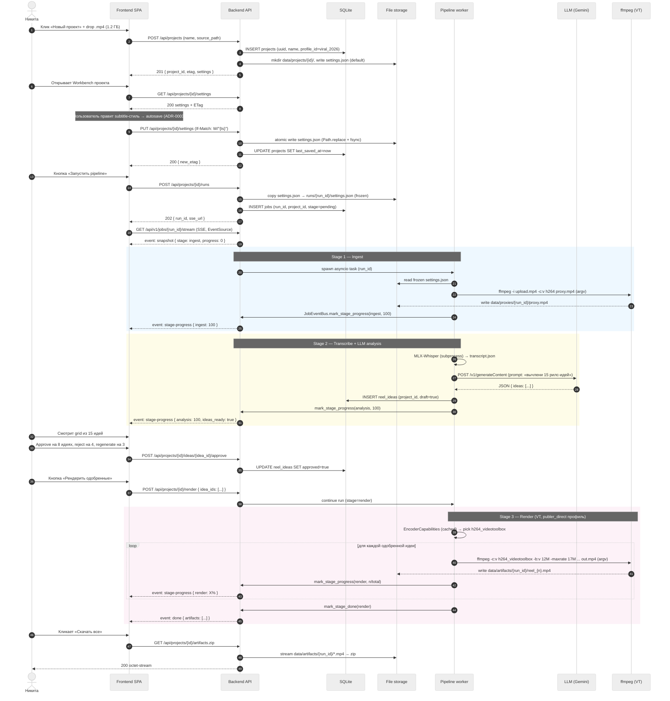

# videomaker — Архитектурный обзор (C4 Level 1–2 + Sequence)

- **Статус:** Принят (ACCEPTED) как итог Этапа 01
- **Дата:** 2026-04-24
- **Авторы:** R-ARCHITECT, R-DEVIL
- **Контекст чанка:** `RM-CHUNKS/01 — Архитектурные решения/REFACTR-12.md` (шаг 13/67)
- **Завершает Этап 01.** Следующий — Этап 02 (REFACTR-13: удаление PRO).

Документ объединяет пять архитектурных решений Этапа 01 в единую картину. Каждая связь и каждый контейнер на диаграммах — проверяемое решение, зафиксированное в ADR.

---

## Ссылки на ADR

| ADR | Название | Что решает |
|-----|----------|------------|
| [ADR-0001](../adr/0001-frontend-stack.md) | Frontend-стек | Vite 6 + React 19 + TanStack Router/Query + Tailwind 4 |
| [ADR-0002](../adr/0002-data-storage.md) | Хранение данных | SQLite (мета + hot-state) + JSON snapshots на диске |
| [ADR-0003](../adr/0003-autosave.md) | Автосохранение | Debounce 10 с + ETag + 4-state UI + offline-очередь |
| [ADR-0004](../adr/0004-video-engine.md) | Видеодвижок | Два профиля: `publer_direct` (H.264 VT) default + `archive_hevc` опционально |
| [ADR-0005](../adr/0005-theming.md) | Темизация | `html[data-theme]` + OKLCH tokens + localStorage persist + flash-prevention |

---

## Level 1 — System Context

### Назначение уровня

Level 1 отвечает на вопрос *«что это за система и с кем/чем она разговаривает»*. Не-технический уровень: без API, без контейнеров, без файлов. Только акторы и внешние сервисы.

### Диаграмма



### Описание участников

| # | Актор / Сервис | Роль | Тип связи |
|---|----------------|------|-----------|
| 1 | **Никита (владелец)** | Единственный пользователь. Открывает браузер на `http://localhost:3000`, загружает видео, одобряет идеи, получает готовые рилсы. | HTTP (local) |
| 2 | **Gemini API** | Default-LLM для анализа транскрипта, генерации идей, написания subtitles. Модель `gemini-2.5-flash`. | HTTPS (external) |
| 3 | **Anthropic API** | Альтернативный LLM для длинных контекстов и высокой точности (Claude Sonnet/Opus). | HTTPS (external, опционально) |
| 4 | **OpenAI API** | Альтернативный LLM (GPT-5 family). | HTTPS (external, опционально) |
| 5 | **Deepgram API** | Облачная транскрипция (nova-3). Используется, если MLX-Whisper недоступен или явно выбран. | HTTPS (external, опционально) |
| 6 | **macOS Finder** | Системная интеграция «Открыть в Finder» для папки проекта. Реализуется через `subprocess.run(["open", "-R", path], ...)`. | OS IPC |
| 7 | **VideoToolbox** | Hardware-энкодер Apple Silicon. Используется через ffmpeg (`h264_videotoolbox`, `hevc_videotoolbox`). | libsystem + IOKit |

### Ключевые инварианты уровня

- **Single-user, localhost, без авторизации.** Нет публичного доступа, нет cookie-session, нет OAuth — только локальная машина владельца. Следствие: нет требований к rate-limit внешних клиентов (только защита `.env`).
- **`.env` ≠ UI.** Ни один API-ключ никогда не отдаётся фронтенду. Gemini/Anthropic/OpenAI/Deepgram вызываются только с бэкенда (см. ADR-0001 §3, REFACTR-24).
- **Обязательных внешних сервисов нет.** Без интернета доступны: MLX-Whisper транскрипция, локальный рендер, базовая обработка. LLM-анализ и Deepgram — деградируемые функции.
- **VideoToolbox — не опция.** На M5 это требование производительности: ≤1.5× realtime на 60-мин видео недостижимо на CPU (libx265 дал бы 3–6×). Fallback на software — только при сбое (см. ADR-0004).

---

## Level 2 — Containers

### Назначение уровня

Level 2 раскрывает, как `videomaker` устроен внутри: какие процессы, какие хранилища, какие протоколы между ними. Разработческий уровень: показывает границы деплоя, но не внутренние пакеты/модули (это уровень 3, для single-user monorepo избыточен).

### Диаграмма



### Контейнеры — таблица

| Контейнер | Технология | Процесс | Что делает | ADR |
|-----------|-----------|---------|------------|-----|
| **Frontend SPA** | Vite 6 + React 19 + TanStack Router v1 + TanStack Query v5 + Tailwind 4 + OKLCH tokens | Node 20 LTS, `pnpm dev` (dev) / статичный build (prod) | Единственный UI: Студия, Workbench, Настройки, Cmd+K. Автосохранение через TanStack `useMutation` + debounce. Темы через `html[data-theme]`. | ADR-0001, ADR-0003, ADR-0005 |
| **Backend API** | FastAPI + Pydantic v2 + SQLAlchemy 2 (async) + aiosqlite | uvicorn (uv-managed venv) | REST-endpoints для проектов, settings-autosave, idea-approve, restart-from-step, Finder-open, health. SSE-стрим прогресса. | ADR-0002, ADR-0003 |
| **Pipeline workers** | asyncio tasks внутри того же uvicorn-процесса + `JobEventBus` | in-process | Ingest → analysis (viral_2026/chaptered branch) → render. Stage progress пишется в SQLite `Project.stage_progress` и эмитируется через SSE. | ADR-0002 |
| **Rendering engine** | ffmpeg 7.1.1 (homebrew, `--enable-videotoolbox`) + PyAV | subprocess (argv-only) | Кодирование клипов в H.264 (default `publer_direct` ≤200 MB Publer) или HEVC (опциональный `archive_hevc` для мастеринга). | ADR-0004 |
| **Transcription engine** | MLX-Whisper (M5-native) или Deepgram nova-3 (HTTPS) | subprocess (MLX) / httpx (Deepgram) | Преобразование аудио в word-level JSON с таймкодами. | REFACTR-05 |
| **SQLite database** | SQLite 3.45 + Alembic (линейная add-only цепочка) | файл `data/videomaker.db` (WAL mode) | 12 прикладных таблиц: `projects`, `jobs`, `artifacts`, `runtime_settings` (EAV), `brand_kit`, `post_production_presets`, `subtitle_style_presets`, `vision_settings`, `prompts`, `profile_masks`, `device_settings`, `scheduler_*`. Новое в REFACTR-14: `stage_progress JSON`, `settings_snapshot_path`, `soft_deleted_at`, `parent_project_id`. | ADR-0002 |
| **File storage** | POSIX filesystem | `data/` | JSON-snapshots проектов (`data/projects/{id}/settings.json` — mutable, autosave; `data/projects/{id}/runs/{run_id}/settings.json` — immutable копия на момент запуска pipeline), uploads, артефакты, транскрипты, превью, логи. | ADR-0002 |

### Протоколы связей

| № | Откуда → куда | Протокол | Детали |
|---|---------------|----------|--------|
| 1 | Browser → Frontend | HTTP (localhost:3000) | Vite dev-server (dev) / статичный hosting (prod в будущем, сейчас дев). |
| 2 | Frontend → Backend | REST (`fetch`) + SSE (`EventSource`) | Все API под `/api/*`. SSE на `/api/v1/jobs/{id}/stream` (стадии + прогресс). Autosave — `PUT /api/projects/{id}/settings` с `If-Match` weak ETag (ADR-0003). Темы — `GET/PUT /api/settings/device` (ADR-0005). |
| 3 | Backend → SQLite | SQLAlchemy async + aiosqlite | WAL mode, единственный writer (бэкенд-процесс). Миграции — Alembic upgrade head при старте. |
| 4 | Backend → File storage | POSIX I/O | Atomic-write для `settings.json` через `Path.replace()` + `os.fsync(fd)`; immutable-pattern для `runs/{run_id}/` (copy-on-run). |
| 5 | Pipeline → Rendering | `asyncio.create_subprocess_exec` (argv-only, NO shell) | ffmpeg параметры собираются в `list[str]`. Progress-parser читает stderr regex `frame=... time=... speed=...` → `JobEventBus.mark_stage_progress`. |
| 6 | Pipeline → Transcription (MLX) | subprocess + JSON over stdout | MLX-Whisper живёт в отдельном процессе, чтобы не блокировать uvicorn event-loop. |
| 7 | Pipeline → Transcription (Deepgram) | httpx async POST | Multipart audio → JSON words. Fallback при отказе MLX или явном выборе. |
| 8 | Pipeline → LLM (Gemini/Anthropic/OpenAI) | httpx async | Вся LLM-логика (идеи, субтитры, B-roll hints) — только на бэкенде. API-ключи никогда не покидают процесс uvicorn. |

### Ключевые инварианты уровня

- **Argv-only для всех subprocess-вызовов.** Нет `shell=True`, нет конкатенации строк — только `list[str]`. Валидируется в REFACTR-25 через semgrep (`python.lang.security.audit.dangerous-subprocess-*`).
- **SQLite — единственный писатель.** Один uvicorn-процесс владеет БД; WAL mode гарантирует concurrent reads без блокировок. Миграции применяются при старте, не runtime.
- **Autosave пишет только `settings.json`, не `runs/{run_id}/`.** Pipeline работает с frozen snapshot, созданным при `POST /api/projects/{id}/runs`; autosave параллельного пользователя не видит его (ADR-0003 §6.3, REFACTR-16).
- **SSE — единственный push-канал.** Polling запрещён — прогресс и stage-transitions идут через `JobEventBus` (REFACTR-05). TanStack Query обновляет кэш через `queryClient.setQueryData` в обработчике `EventSource`.
- **VideoToolbox detection — кеш при старте.** `EncoderDetector` один раз при старте uvicorn проверяет `ffmpeg -encoders` и кладёт `EncoderCapabilities` в singleton `runtime_settings` (ADR-0004). Не переспрашивается на каждый рендер.

---

## Sequence 1 — «Новый проект до готового рилса»

### Назначение диаграммы

Показывает полный путь от первого клика владельца до скачивания готового клипа. Покрывает: upload → transcribe → LLM-анализ → approve идеи → render → download. Объединяет ADR-0002 (snapshot), ADR-0003 (автосейв промежуточных настроек), ADR-0004 (encoder-выбор).

### Диаграмма



### Комментарий к диаграмме

- **Шаги 1–4** покрывают создание — SQLite-row + настройка по умолчанию из ADR-0002.
- **Шаги 5–10** — autosave-цикл, детали в ADR-0003 Sequence «Нормальный поток».
- **Шаг 11** — frozen snapshot. Это ключ к restart-from-step (REFACTR-16): даже если пользователь продолжит править `settings.json`, текущий run читает замороженную копию.
- **Stage 1 (Ingest)** использует software H.264 для proxy — hardware не нужен (одна копия, низкий битрейт).
- **Stage 2 (Analysis)** выбор `viral_2026` branch — единственный оставшийся после REFACTR-13 (бок с `chaptered` legacy). PRO удалён.
- **Stage 3 (Render)** — hardware H.264 `publer_direct` по умолчанию. Размер каждого 90-с рилса ≈135 MB при 12 Mbps VBR (с запасом от Publer ≤200 MB).
- **SSE-канал един** для всех стадий — frontend не polling-ит, TanStack Query-кэш обновляется в обработчике `EventSource`.

---

## Sequence 2 — «Автосохранение с конфликтом двух вкладок»

### Назначение диаграммы

Показывает автосохранение в нормальном режиме и разрешение конфликта, когда пользователь открыл проект в двух вкладках (например, на втором мониторе). Покрывает ADR-0003 полностью. Это **самый важный edge-case** локалки: без правильной работы с ETag одна вкладка тихо перетирает другую.

### Диаграмма

```mermaid
%%{init: {'theme':'neutral'}}%%
sequenceDiagram
    autonumber
    actor User as Никита
    participant Tab1 as Вкладка A<br/>(основной монитор)
    participant Tab2 as Вкладка B<br/>(второй монитор)
    participant API as Backend API
    participant DB as SQLite
    participant FS as File storage

    Note over Tab1,Tab2: Обе вкладки открывают один проект в 10:00:00
    Tab1->>API: GET /api/projects/{id}/settings
    API->>DB: SELECT last_saved_at FROM projects
    API->>FS: read settings.json
    API-->>Tab1: 200 settings + ETag: W/"1714000000000"

    Tab2->>API: GET /api/projects/{id}/settings
    API-->>Tab2: 200 settings + ETag: W/"1714000000000"

    rect rgb(240, 253, 244)
        Note over Tab1,API: Нормальный поток — вкладка A первая
        User->>Tab1: Правит subtitle font_size (60 → 68)
        Note over Tab1: state: dirty → UI: debouncing 10 с
        User->>Tab1: Пауза > 10 с
        Note over Tab1: Debounce истёк → state: saving
        Tab1->>API: PUT /api/projects/{id}/settings<br/>If-Match: W/"1714000000000"<br/>body: { ..., font_size: 68 }
        API->>DB: SELECT last_saved_at (ETag match? да)
        API->>FS: atomic write settings.json (Path.replace + fsync)
        API->>DB: UPDATE projects SET last_saved_at=1714000030000
        API-->>Tab1: 200 { last_saved_at } + ETag: W/"1714000030000"
        Note over Tab1: state: idle → "Сохранено 0 с назад"
    end

    rect rgb(254, 242, 242)
        Note over Tab2,FS: Конфликт — вкладка B не знает о вкладке A
        User->>Tab2: Правит subtitle colour (gold → amber)
        Note over Tab2: debounce 10 с → state: saving
        Tab2->>API: PUT /api/projects/{id}/settings<br/>If-Match: W/"1714000000000"<br/>body: { ..., colour: amber }
        API->>DB: SELECT last_saved_at → W/"1714000030000"
        Note over API: ETag mismatch — конфликт
        API->>FS: read текущий settings.json
        API-->>Tab2: 409 Conflict<br/>{ error, current_etag, current_snapshot, current_last_saved_at }

        Note over Tab2: state: conflict → &lt;ConflictDialog /&gt;
        Tab2-->>User: Модалка: 3 опции
    end

    alt Пользователь выбрал «Перезагрузить»
        User->>Tab2: Клик «Перезагрузить актуальную версию»
        Tab2->>API: GET /api/projects/{id}/settings
        API-->>Tab2: 200 (свежие данные с font_size=68) + ETag
        Note over Tab2: dirty changes потеряны, UI обновлён
    else Пользователь выбрал «Перезаписать»
        User->>Tab2: Клик «Сохранить мою версию»
        Tab2->>API: PUT /api/projects/{id}/settings<br/>If-Match: W/"1714000030000" (из 409 response)<br/>body: { ..., colour: amber }
        API->>FS: copy settings.json → .trash/conflict-{ts}.json
        API->>FS: atomic write settings.json
        API->>DB: UPDATE projects SET last_saved_at=1714000060000
        API-->>Tab2: 200 + ETag: W/"1714000060000"
        Note over Tab2: state: idle, снапшот перезаписан (font_size=68 ушёл в .trash)
    else Пользователь выбрал «Отменить»
        User->>Tab2: Клик «Отменить»
        Note over Tab2: state: dirty остаётся, UI без изменений
    end

    rect rgb(249, 250, 251)
        Note over Tab1,Tab2: Cross-tab sync (storage event) для темы
        User->>Tab1: Cmd+Shift+L (переключил dark → light)
        Tab1->>Tab1: localStorage.setItem('videomaker-theme', 'light')
        Tab1->>API: PUT /api/settings/device { theme: 'light' }
        Tab2->>Tab2: window.onstorage → document.documentElement.dataset.theme = 'light'
        Note over Tab2: Вторая вкладка переключилась без reload
    end
```

### Комментарий к диаграмме

- **Шаги 1–4** — начальная загрузка двух вкладок с одинаковым ETag (`W/"1714000000000"`).
- **Шаги 5–10 (зелёный блок)** — нормальный поток, `If-Match` совпадает, запись проходит.
- **Шаги 11–15 (красный блок)** — вторая вкладка посылает устаревший ETag → `409 Conflict`. Сервер возвращает текущий snapshot, чтобы фронт показал diff. Ключевой паттерн RFC 7232.
- **Шаги 16–23** — три опции разрешения. Опция «Перезаписать» копирует перетираемые данные в `.trash/conflict-{ts}.json` (REFACTR-17 cleanup), чтобы пользователь всегда мог восстановить потерянное.
- **Шаги 24–27 (серый блок)** — cross-tab sync темы через нативный `storage` event браузера (ADR-0005). Не требует SSE, не требует backend-round-trip — работает мгновенно.
- **Offline-случай** (не показан): при недоступности бэкенда payload падает в `localStorage['videomaker.autosave.queue.{project_id}']` как last-only, health-poll каждые 5 с flushит при восстановлении (ADR-0003 §5.3).

---

## Инварианты всей системы (сводка)

| № | Инвариант | Где закреплено | Тест |
|---|-----------|----------------|------|
| 1 | Single-user, localhost, без auth | ADR-0001 §2 | Нет login-route в `apps/frontend/src/routes/**`. |
| 2 | `.env` никогда не покидает бэкенд | ADR-0001 §3, REFACTR-24 | `grep -R GEMINI_API_KEY apps/frontend/` = пусто. |
| 3 | SQLite — single writer (uvicorn-процесс) | ADR-0002 §4 | Alembic upgrade head при старте, WAL mode, нет second-uvicorn паттернов. |
| 4 | Autosave пишет только `settings.json`, не `runs/{id}/` | ADR-0003 §6.3 | Smoke-тест REFACTR-62: правка settings во время run не меняет frozen snapshot. |
| 5 | Все subprocess-вызовы — argv-only | ADR-0004 §4, REFACTR-25 | semgrep `python.lang.security.audit.dangerous-subprocess` = 0. |
| 6 | VideoToolbox по умолчанию, software fallback | ADR-0004 §4 | `GET /api/health` возвращает `h264_videotoolbox: true` на M5. |
| 7 | Тема применяется до React-монтирования (no FOUC) | ADR-0005 §6.1 | Chrome DevTools Throttle 6× CPU, запись FCP — нет mismatch. |
| 8 | `data/projects/`, `data/uploads/`, `.env` — never deleted without owner confirmation | task.md §6.5 | `scripts/cleanup_orphans.py` никогда не трогает mentioned пути без `--force` + флаг подтверждения. |

---

## Направление развития (Этап 02 и далее)

Этап 01 зафиксировал контракты. Этап 02 (REFACTR-13..20, чанки 14–21/67) реализует их на бэкенде:

1. **REFACTR-13** — удалить PRO / `narrative_mode="bottom_up"|"map_reduce"` (сохранить viral_2026 + chaptered).
2. **REFACTR-14** — расширить `Project` (settings_snapshot_path, stage_progress JSON, soft_deleted_at, parent_project_id) + Alembic миграция.
3. **REFACTR-15** — реализовать `PUT/GET /api/projects/{id}/settings` + ETag (ADR-0003).
4. **REFACTR-16** — реализовать `POST /api/projects/{id}/restart` + frozen snapshot per-run (ADR-0002).
5. **REFACTR-17** — реализовать copy-from-project + `.trash/` cleanup.
6. **REFACTR-18** — Finder-open + soft/hard delete.
7. **REFACTR-19–20** — сервис идей рилсов + approve/reject/regenerate endpoints.

Этап 03 — рендер и безопасность (VideoToolbox бенчмарк + semgrep + rate-limit). Этапы 04–08 — фронт (миграция + дизайн-система + Студия + Workbench + настройки). Этап 09 — run.sh. Этап 10 — финализация.

---

## Gate-чекпоинт Этапа 01

Для владельца (человеческий gate перед Этапом 02):

- [ ] Прочитать все 5 ADR (0001–0005). Каждый ~15 минут.
- [ ] Прочитать этот документ (C4 + 2 sequence).
- [ ] Подтвердить: Vite + React + TanStack + Tailwind 4 — OK.
- [ ] Подтвердить: SQLite + `data/projects/{id}/settings.json` + runs/{run_id}/settings.json — OK.
- [ ] Подтвердить: autosave debounce 10 с + ETag + conflict-модалка — OK.
- [ ] Подтвердить: H.264 VT default (publer_direct) + HEVC опционально (archive_hevc) — OK.
- [ ] Подтвердить: `html[data-theme]` + OKLCH + localStorage persist + cross-tab sync — OK.

Если хотя бы один «нет» — откат к соответствующему REFACTR-NN с поправкой. Если все «да» — старт Этапа 02 с REFACTR-13.

---

**Документ закрывает Этап 01.** Архитектурная основа зафиксирована; следующая итерация Looper работает на бэкенде (REFACTR-13 — удаление PRO).
