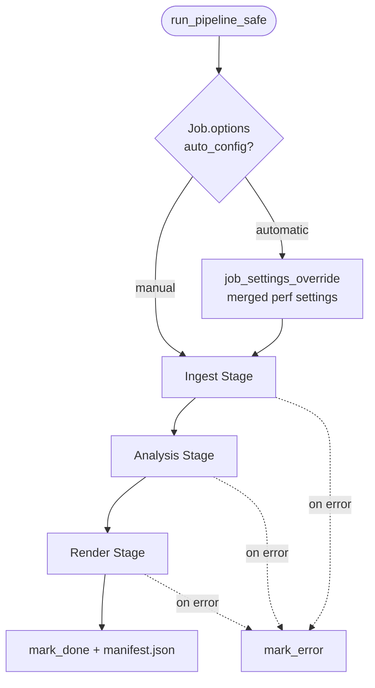
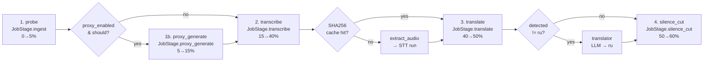
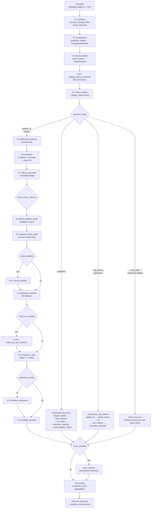
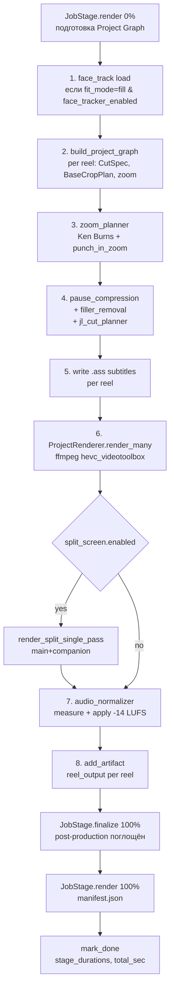

# 05 — Pipeline Stages и зависимости

> **Чанк:** REFACTR-05 (6 из 67). **Этап:** 00 — Исследование и аудит.
> **Дата:** 2026-04-24. **Роль:** R-AUDITOR + R-PIPELINE-ENG (консультативно).
> **Зависимости:** REFACTR-00 (backend map).
> **Следующий шаг:** REFACTR-06 (UX-боли).

---

## 0. Резюме

- **Точка входа:** `run_pipeline_safe(*, job_id, source_path, ...)` в `services/pipeline.py:240` — обёртка с обработкой ошибок + Automatic mode override.
- **Композиция:** `run_pipeline_safe` → `run_pipeline` → `_run_pipeline_impl` (создаёт `PipelineContext`) → `run_ingest_stage` → `run_analysis_stage` → `run_render_stage` → `PipelineResult`.
- **State shared через** `PipelineContext` (dataclass slots, 170 LoC, `services/pipeline_context.py`) — mutable, обогащается каждой стадией.
- **Три верхних фазы:** `ingest` (probe → proxy → transcribe → translate → silence_cut) → `analysis` (Kartoziya 8-stage ИЛИ chaptered top-down ИЛИ map_reduce ИЛИ viral_2026 — одна из 4 веток) → `render` (Project Graph → ffmpeg HEVC + subtitles + split-screen + intro/outro).
- **Progress reporting:** 9 значений `JobStage` маппятся в диапазоны 0-100% через `_STAGE_RANGES` в `pipeline.py:55-65`.
- **SSE:** `JobEventBus` (in-memory pub/sub, `services/job_event_bus.py`, 47 LoC) → GET `/api/v1/jobs/{id}/stream` (jobs.py:1202) → `EventSource` на фронте (`apps/frontend/src/lib/sse.ts:76`).
- **Restart-from-step:** **отсутствует**. Артефакты на диске есть, но никакой endpoint/API не умеет запускать pipeline с произвольного шага. Это REFACTR-16 (Этап 02).

---

## 1. Граф стадий

### 1.1. Верхний уровень (Mermaid)



### 1.2. Ingest substages (`pipeline_stages/ingest.py`, 347 LoC)



### 1.3. Analysis substages (`pipeline_stages/analysis.py`, 1454 LoC)

Четыре ветки переключаются через `PerformanceSettings.narrative_mode` (см. REFACTR-03).



**Bottom-up полный**: 11 substages. **Chaptered**: 1 substage (оркестратор делегирует). **Map_reduce**: 1 substage (4 под-вызова внутри). **Viral 2026**: 1 substage (LLM генерирует рилсы напрямую).

### 1.4. Render substages (`pipeline_stages/render.py`, 1733 LoC)



---

## 2. Таблица вход/выход/артефакты

### 2.1. Ingest Stage

| # | Substage | JobStage | Вход | Выход в Context | Файлы | БД |
|---|----------|----------|------|-----------------|-------|-----|
| 1 | probe | ingest | `source_path` | `media_info` | — | `jobs.source_duration_sec` |
| 2 | proxy_generate | proxy_generate | `source_path`, `perf.proxy_*` | `proxy_path`, `media_path_for_decode` | `data/proxies/<sha>__<id>.mp4` (content-addressed) | `artifacts` row kind=proxy |
| 3 | transcribe | transcribe | `media_path_for_decode`, `transcriber_name`, `source_language` | `transcript`, `transcript_segments/words`, `detected_language` | `data/transcripts/<sha>/transcript.json` (cache) + `data/artifacts/<job>/text/transcript.json` | `artifacts` row kind=transcript; `jobs.detected_language` |
| 4 | translate | translate | `transcript`, `detected_language` | `transcript` (переписан), `needs_translation` | `data/artifacts/<job>/text/translated_transcript.json` (если переведён) | `artifacts` row kind=transcript (2-я, translated_from meta) |
| 5 | silence_cut | silence_cut | `transcript`, `silence_cfg` (из `silence_cutter.load_config`) | `cleaned_transcript`, `cleaned_words`, `cleaned_path` | `data/artifacts/<job>/text/cleaned_transcript.json` | `artifacts` row kind=cleaned_transcript |

### 2.2. Analysis Stage — Preamble (общий для всех narrative_mode)

| # | Substage | JobStage % | Вход | Выход в Context | Файлы |
|---|----------|-----------|------|-----------------|-------|
| 5.1 | chunk_transcript / semantic_chunk_transcript | — | `cleaned_transcript`, `semantic_chunking_enabled` | `chunks` | — (in-memory) |
| 5.2 | compress_chunks | analyze 5% | `chunks`, `pipeline_provider` | `compression` | — |
| 5.3 | build_canvas | analyze 20% | `compression`, `media_info`, `_pro_llm` | `canvas` (ProjectCanvas) | `data/artifacts/<job>/text/canvas_full.json` |
| 5.3.5 | embed_canvas_moments | — | `canvas`, `cleaned.words` | `canvas.candidate_moments[].embedding` | — |
| 5.4 | get_vision_settings + get_effective_profile_mask | — | `cfg`, `vision_profile` | `vision_runtime`, `profile_mask` | — |

### 2.3. Analysis Stage — bottom_up branch (УДАЛЯЕТСЯ, REFACTR-13)

| # | Substage | JobStage % | Вход | Выход в Context | Файлы |
|---|----------|-----------|------|-----------------|-------|
| 5.5 | load_liked_anchors_text | — | `artifacts` БД + embedding_json | `preference_anchors` | — |
| 5.6 | orchestrate_extraction (6 agents + visual 7th) | analyze 35% | `chunks`, `canvas`, `profile_mask`, `preference_anchors` | `extraction_result` | `data/artifacts/<job>/text/extraction_full.json` |
| 5.7 | reduce_and_rank + ensemble | analyze 60% | `extraction`, `canvas`, `reducer_ensemble_size` | `reduce_result` | — (in-memory RankedEvidence) |
| 5.7.5 | apply_cross_chunk_coherence (opt) | — | `reduce_result.ranked`, `cross_chunk_strictness` | filtered `reduce_result.ranked` | — |
| 5.8 | detect_pipeline_mode | — | `cleaned.words`, `media_info`, `vision_runtime.enabled` | `story_mode` ("dialogue"/"travel") | — |
| 5.9 | _compose_with_rhythm_loop (compose_story_script + check_rhythm ×1-3) | analyze 72% | `canvas`, `ranked`, `story_mode`, `rhythm_critique_loop_enabled` | `story_script`, `rhythm_report` | `data/artifacts/<job>/text/story_script.json` |
| 5.9.5 | _apply_visual_validator (opt, vision_enabled) | analyze 84% | `story_script`, `source_path`, `vision_profile` | updated `story_script` | — |
| 5.10 | generate_variants (Pro 4 формата) ИЛИ _fallback_variants | analyze 88% | `canvas`, `ranked`, `story_script` | `variants` | — |
| 5.10.5 | build_arcs_per_moment (opt, multi_arc_enabled) | analyze 91% | `canvas`, `ranked`, `window_scales` | `per_moment_arcs` | `data/artifacts/<job>/text/per_moment_arcs.json` |
| 5.11 | compose_reels (target N + dedup) | — | `canvas`, `ranked`, `story_script`, `variants`, `per_moment_arcs` | `analysis` | — |
| 5.12 | validate_coherence (opt) | analyze 94% | `analysis`, `cleaned.words`, `coherence_mode/threshold` | filtered/resorted `analysis` | — |
| 5.13 | validate_closures | analyze 95% | `analysis`, `cleaned.words`, `canvas` | tail-trimmed `analysis` | — |

### 2.4. Analysis Stage — chaptered branch (ОСТАЁТСЯ legacy)

| # | Substage | JobStage % | Вход | Выход | Файлы |
|---|----------|-----------|------|-------|-------|
| 5.5 | orchestrate_top_down | analyze 40% | `cleaned_transcript`, `canvas`, `source_duration_sec`, `target_count` | `analysis` | — (внутренние вызовы chapter_builder → hook_detector → arc_finder → boundary_extender → cross_chapter_ranker) |

### 2.5. Analysis Stage — map_reduce branch (УДАЛЯЕТСЯ, REFACTR-13)

| # | Substage | JobStage % | Вход | Выход | Файлы |
|---|----------|-----------|------|-------|-------|
| 5.5 | orchestrate_map_reduce | analyze 40% | `cleaned_transcript`, `canvas`, `narrative_chunk_*` | `analysis` | — (global_context → chunk_scorer×N → clip_reducer → boundary_extender) |

### 2.6. Analysis Stage — viral_2026 branch (production default)

| # | Substage | JobStage % | Вход | Выход | Файлы |
|---|----------|-----------|------|-------|-------|
| 5.5 | build_viral_arcs | analyze 40% | `cleaned_transcript`, `cfg` (использует `VIRAL_2026_PROMPT`) | `analysis.reels` | — (LLM calls c rate_limiter) |

### 2.7. Analysis Stage — Common Post-processing (все branches)

| # | Substage | JobStage % | Вход | Выход | Файлы |
|---|----------|-----------|------|-------|-------|
| 6.1 | _apply_cover_selector (opt, vision_enabled) | analyze 92-97% | `analysis.reels`, `source_path` | `analysis` с cover metadata | — (Moondream thumbnail selection) |
| 6.2 | _populate_reel_scoring | — | `analysis`, `rhythm_report`, `story_script` | `analysis.stats` enriched | — |
| 6.3 | write reel_plan.json + analysis_summary.json | analyze 100% | `analysis` | `reel_plan_path`, `analysis_summary_path` | `data/artifacts/<job>/text/{reel_plan,analysis_summary}.json` + `artifacts` row kind=reel_plan |

### 2.8. Render Stage

| # | Substage | JobStage % | Вход | Выход | Файлы | БД |
|---|----------|-----------|------|-------|-------|-----|
| 7.1 | track_faces (opt, face_tracker_enabled & fit_mode=fill) | render 0% | `media_path_for_decode` | `face_track: FaceTrackResult` | `data/face_cache/<uuid>/*` | — |
| 7.2 | build_project_graph per reel | render 10% | `analysis_reels`, `words`, `face_track`, `profile_mask` | list[ProjectGraph] | `data/artifacts/<job>/text/project_graphs.json` | `artifacts` row kind=project_graph |
| 7.3 | zoom_planner (build_zoom_plan, build_base_crop_plan) | — | graph, `perf.ken_burns_*`, `punch_in_zoom_*`, `face_track` | graph w/ zoom specs | — | — |
| 7.4 | compress_pauses_in_cuts + remove_fillers + plan_jl_cuts (opt toggles) | — | graph, perf toggles | mutated graph | — | — |
| 7.5 | write_ass (subtitles per reel) | — | ReelPlan.segments, subtitle_style | `data/artifacts/<job>/subs/r*.ass` | file | — |
| 7.6 | ProjectRenderer.render_many | render 20-90% | list[ProjectGraph], `render_source` | RenderedReel list | `data/artifacts/<job>/reels/r*.mp4` | `artifacts` row kind=reel_output (per reel) |
| 7.6.1 | render_split_single_pass (opt, split_screen.enabled) | — | main render + companion asset | — | `data/post_production_assets/<id>__<name>.mp4` (read-only) | — |
| 7.7 | audio_normalizer (measure + -14 LUFS) | — | rendered reels | rendered w/ achieved_lufs | file (in-place) | — |
| 7.8 | write manifest.json | render 100% | rendered list | — | `data/artifacts/<job>/manifest.json` | — |
| 7.9 | mark_done | done | — | — | — | `jobs.status=done`, `finished_at`, `stage_durations` |

---

## 3. Точки возобновления (checkpoint analysis)

**Критический вывод:** текущая реализация **не поддерживает restart-from-step**. Все stages запускаются последовательно внутри одной async-функции `_run_pipeline_impl`. Нет:
- API endpoint для «restart from stage X»
- Skip-logic на основе существующих артефактов (только transcript имеет SHA256-cache)
- Stage-level idempotency (повторный прогон пересчитает всё)

Однако артефакты **физически сохраняются на диске** → restart-from-step реализуем. Ниже — классификация по наличию чекпоинта.

| Substage | Checkpoint на диске? | Restart возможен без пересчёта? | Примечание |
|----------|----------------------|--------------------------------|------------|
| probe | — | нет (дёшево) | 1 ffprobe, ~0.5s |
| proxy_generate | `data/proxies/<sha>__<id>.mp4` | **да, content-addressed** | Уже реализовано через `generate_or_get_proxy` — hash lookup skip |
| transcribe | `data/transcripts/<sha>/transcript.json` | **да, content-addressed** | Полный skip при cache hit (одинаковый file + transcriber + model) |
| translate | `data/artifacts/<job>/text/translated_transcript.json` | нет automatic | Artifact пишется, но нет skip-логики на основе его наличия |
| silence_cut | `data/artifacts/<job>/text/cleaned_transcript.json` | нет automatic | Тот же случай |
| analyze.compression | — | нет | Не сохраняется на диск, только в context |
| analyze.canvas | `data/artifacts/<job>/text/canvas_full.json` | нет automatic | Есть файл, нет skip |
| analyze.extraction | `data/artifacts/<job>/text/extraction_full.json` (bottom_up) | нет automatic | Только top-20 evidence сэмпл, full — нет |
| analyze.story_script | `data/artifacts/<job>/text/story_script.json` (bottom_up) | нет automatic | — |
| analyze.per_moment_arcs | `data/artifacts/<job>/text/per_moment_arcs.json` (bottom_up, multi_arc) | нет automatic | — |
| analyze.reel_plan | `data/artifacts/<job>/text/reel_plan.json` | нет automatic | Есть файл, нет skip |
| analyze.analysis_summary | `data/artifacts/<job>/text/analysis_summary.json` | нет automatic | — |
| render.project_graph | `data/artifacts/<job>/text/project_graphs.json` | нет automatic | — |
| render.subtitles | `data/artifacts/<job>/subs/r*.ass` | нет automatic | Если пользователь отредактировал — перезапишется при restart. Требует explicit flag |
| render.reels | `data/artifacts/<job>/reels/r*.mp4` | нет automatic | — |

**Для REFACTR-16** нужно реализовать:

1. Новое поле `Project.stage_progress` (JSON, см. REFACTR-04) — отслеживает статус каждой substage `{status: done/running/pending, started_at, finished_at}`.
2. API endpoint `POST /api/v1/projects/{id}/restart?from_stage=<name>` — запускает pipeline начиная со стадии `from_stage`, переиспользуя артефакты предыдущих.
3. В каждой substage — skip-check: если `ctx.stage_progress[stage] == "done"` и артефакт существует → загрузить из файла, не пересчитывать. Это требует per-stage loader-функций.
4. UI-контрол на Workbench'е: «Начать заново с шага X» → dropdown стадий + confirmation.

**Проблемы для учёта при реализации:**
- Некоторые substages мутируют глобальное состояние (например, `add_artifact` пишет в БД). Повторный прогон может создать duplicate rows. **Решение:** перед запуском стадии — удалить соответствующие `artifacts` rows и файлы этой стадии и downstream.
- `compression`, `detect_pipeline_mode`, toggles — быстрые, пересчитать дешевле, чем сохранять чекпоинт.
- `transcribe` + `proxy_generate` уже имеют content-addressed cache — работает «прозрачно». Требуется лишь убрать `force_reingest` override при restart-from-later-stage.

---

## 4. SSE events

### 4.1. Инфраструктура

`JobEventBus` (`services/job_event_bus.py`, 47 LoC):
- In-memory `dict[job_id, list[Queue]]` с `asyncio.Lock`.
- `subscribe(job_id) → Queue` (maxsize=256 → `SSE_QUEUE_MAX`).
- `publish(job_id, event)` — `queue.put_nowait`; при `QueueFull` — warning log, event отбрасывается.
- `unsubscribe(job_id, queue)` — убирает из подписчиков, удаляет job_id-key если подписчиков не осталось.

Endpoint `/api/v1/jobs/{id}/stream` (`jobs.py:1202-1249`):
- 404 если job не найден.
- Шлёт первый event — **snapshot** текущего состояния job.
- Если job уже `done/error/cancelled` → return сразу после snapshot.
- Иначе цикл `queue.get()` с `asyncio.wait_for(KEEPALIVE_INTERVAL_SEC)`; timeout → `: keepalive\n\n`; event → `data: <json>\n\n`.
- При `event.status in {done, error, cancelled}` → graceful завершение.

Frontend (`apps/frontend/src/lib/sse.ts`):
- `EventSource` подключается на `${SSE_BASE_URL}/api/v1/jobs/<id>/stream`.
- React hook `useSSE(jobId)` с `useRef<EventSource>` для lifecycle.

### 4.2. Формат event'ов

**Snapshot (на subscribe):**
```json
{
  "stage": "<JobStage.value>" | "created",
  "progress": 0-100,
  "status": "pending" | "running" | "done" | "error" | "cancelled",
  "message": "string | null",
  "job_id": "uuid"
}
```

**Stage-progress (`service.mark_stage`, jobs.py:286-319):**
```json
{
  "stage": "<JobStage.value>",
  "progress": 0-100,
  "message": "compression: 12 chunks через Flash Lite",
  "status": "running",
  /* extra полиморфные поля: */
  "cache_hit": true,
  "video_hash": "sha...",
  "word_count": 8432,
  "language": "ru",
  "cached_backend": "mlx-whisper",
  "cached_model": "large-v3"
  /* ... */
}
```

**Job-created (`service.create_job`, jobs.py:165):**
```json
{
  "stage": "created",
  "job_id": "uuid",
  "status": "pending",
  "progress": 0
}
```

**Profile-changed (`service.update_vision_profile`, jobs.py:221):**
```json
{
  "stage": "profile_changed",
  "old_profile": "talking_head",
  "new_profile": "travel"
}
```

**mark_done (jobs.py:347-358):**
```json
{
  "stage": "done",
  "progress": 100,
  "message": "25 рилсов готовы",
  "status": "done",
  "stage_durations": {"ingest": 4.2, "transcribe": 32.1, "analyze": 240.5, "render": 400.0},
  "total_generation_sec": 676.8,
  "reel_count": 25,
  "avg_composite_score": 82.4,
  "manifest": "manifest.json"
}
```

**mark_error (jobs.py:374-380):**
```json
{
  "stage": "error",
  "error": "ffmpeg: libmp3lame not available",
  "status": "error"
}
```

### 4.3. Публикаторы

| Источник | Файл:строка | Stage/event |
|----------|-------------|-------------|
| `create_job` | `jobs.py:165` | `created` |
| `update_vision_profile` | `jobs.py:221` | `profile_changed` |
| `mark_stage` | `jobs.py:310` (из `_advance`) | каждый substage |
| `mark_done` | `jobs.py:347` | `done` + timings |
| `mark_error` | `jobs.py:374` | `error` |

Pipeline-stages публикуют ТОЛЬКО через `_advance(service, job_id, stage, inside_percent, message, extra=...)` из `pipeline.py:332-346`, который внутри зовёт `service.mark_stage`. Это централизует SSE-publishing и не даёт стадиям обойти bus.

### 4.4. Потоковое поведение

| Характеристика | Значение |
|----------------|----------|
| Keepalive | `: keepalive\n\n` каждые `KEEPALIVE_INTERVAL_SEC` (не найдено константы в jobs.py в read'ах; стандартно 15с) |
| Queue overflow | Event dropped + warning. Фронт может пропустить промежуточный progress |
| Re-subscribe | Новая подписка — новая Queue. Snapshot гарантированно шлёт текущее состояние |
| Backpressure | QueueFull = фронт не успевает читать (редко, т.к. 256 ёмкость). Для long-running job'а рекомендуется EventSource auto-reconnect |
| Auto-close | После `done/error/cancelled` генератор return; EventSource на фронте получит `readyState=CLOSED` |

---

## 5. Итого: карта проблем pipeline для последующих REFACTR

### 5.1. Для Этапа 02 (backend cleanup)

| Проблема | REFACTR | Описание |
|----------|---------|----------|
| Pipeline не знает про restart-from-step | REFACTR-16 | Новое поле `Project.stage_progress`, endpoint `POST /projects/{id}/restart`, per-stage loader/skip logic. |
| PRO (bottom_up, map_reduce) код болтается | REFACTR-13 | Удаление ампутацией (см. REFACTR-03). |
| `project_graphs.json` пишется в render, но никогда не загружается | REFACTR-16 | Единый формат snapshot'а для restart. |
| `_advance` hardcoded прогресс-шкалой | — | `_STAGE_RANGES` — фиксированный split. После viral_2026-only становится проще (меньше стадий). Возможно упрощение после REFACTR-13. |

### 5.2. Для Этапа 03 (render + security)

| Проблема | REFACTR |
|----------|---------|
| Нет rate-limit на SSE | REFACTR-26 |
| SSE endpoint не требует auth (но приложение локальное) | REFACTR-25 — локальный контекст, risk=low |

### 5.3. Для Этапа 09 (DevX)

| Проблема | REFACTR |
|----------|---------|
| `data/logs/` пустая, нет файлового логирования | REFACTR-59 |
| `_STAGE_RANGES` не учитывает, что в viral_2026 `analyze` занимает <10% общего времени — шкала некорректна | REFACTR-49 (Studio/Workbench UX) |

---

## 6. GATE-чекпоинт (REFACTR-05)

- [x] Полный граф стадий построен: 3 Mermaid-диаграммы (top-level, ingest, analysis 4-branch switch, render).
- [x] Все стадии инвентаризированы: 15 substages для bottom_up + 1 для chaptered + 1 map_reduce + 1 viral_2026 + 9 render substages.
- [x] Точки возобновления классифицированы: transcribe/proxy имеют automatic cache, остальные пишут артефакты но не умеют skip — реализация REFACTR-16.
- [x] SSE-события перечислены: 6 типов событий (snapshot/created/stage/profile_changed/done/error), централизованный publish через `mark_stage`.

---

## 7. Следующий чанк

**REFACTR-06** — UX-боли: каталогизация известных и обнаруженных проблем пользовательского опыта (OOM, h-scroll, no-autosave, no-cmd-k, no-restart-from-step, flat post-production, PRO-slot висит в UI, нет Studio).
